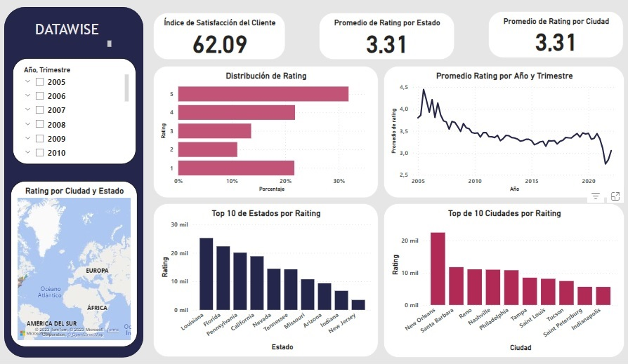
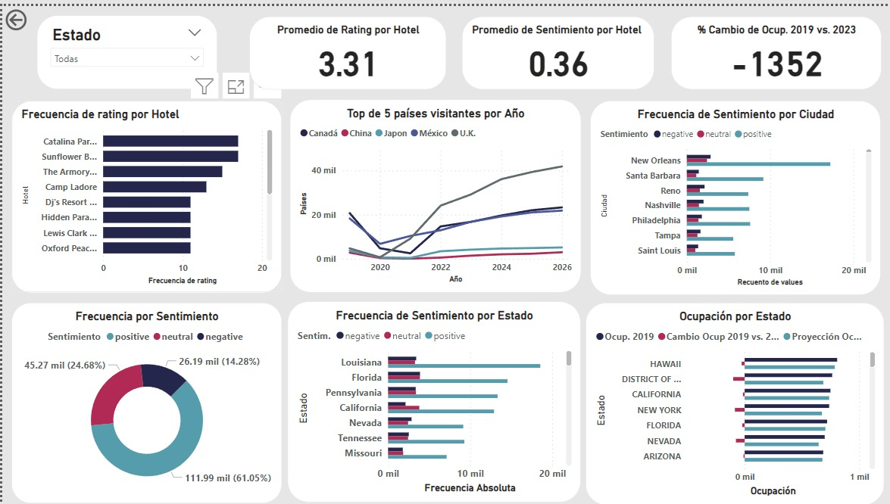

<h1 align='center'>
 <b>Proyecto  Final</b>
</h1>

***
<h1 align='center'>
<b>Hoteles 🏨🥂🏝</b>
</h1>

  

***
Nuestra empresa de Consultoría, Data Wise, se especializa en la organización, clasificación y procesamiento de los datos proporcionados por nuestros clientes, generando informes completos y detallados. En esta ocasión, nuestro compromiso es brindar un enfoque analítico integral para extraer información valiosa de los datos, con el objetivo de ofrecer a nuestros clientes una visión clara y precisa del estado actual de su negocio.

  

  

### **Objetivo General**
***
* Para este proyecto se plantea conocer los principales aspectos de la industria hotelera en Estados Unidos, además de analizar las reseñas de los usuarios usando un modelo de ML.
  
### **Objetivo Específicos**
***
* Por medio del  diagrama de arquitectura explicar el flujo del dato.
* Entender cómo se cargan los datos a Google Cloud desde su origen.
* Hacer una demostración de carga incremental en el Datawarehouse.
* Presentar un  dashboard en PowerBI con KPI’s del caso de estudio.
* Dar a conocer algunos hallazgos relevantes adicionales.

  
***
### ⌛KPI's
***
Los indicadores de desempeño que se emplearon para analizar la información son los siguientes:

1. **Índice de Satisfacción del Cliente**: Evalúa la satisfacción general de los usuarios en relación con los productos/servicios mediante el análisis de los sentimientos expresados en las reseñas proporcionadas.
2. **Promedio de Rating por Ciudad o Estado**:
Calcula el promedio de los valores de 'rating' para analizar cómo califican los usuarios los hoteles en diferentes ciudades o estados.
3. **Distribución de Ratings**: Analiza la distribución de los valores de 'rating' para entender la proporción de reseñas positivas, neutrales y negativas.
4.	**Promedio de Rating por Hotel**: Calcula el promedio de los valores de 'rating para analizar cómo califican los usuarios una cadena hotelera o un hotel en particular.
5.	**Promedio de Sentimiento por Hotel**: Calcula el promedio del sentimiento en las categorías positiva (1), negativa (0) y neutra (-1), teniendo en cuenta la percepción de los usuarios.
6.	**% Crecimiento de la ocupación 2019 vs. 2023**: Indica la proporción en la que ha crecido la ocupación hotelera, en el periodo de tiempo indicado. 

***
### **👀Alcances y Limitaciones**
***
El presente estudio se limitará al análisis del sector hotelero y tan sólo de manera complementaría desarrollará un sistema de recomendaciones de restaurantes para huespedes de los hoteles.

El estudio del sector se hará principalmente a través de un análisis de sentimientos que se realizará sobre las reseñas de usuarios de Yelp y Google Maps utilizando NLP (Natural Lenguage Processing).

El pronóstico que haremos será para la industria hotelera. Analizaremos tendencias históricas para este sector y buscaremos relacionarlo con la tasa fed y el desempleo para reforzar nuestro "forecast".

Para realizar recomendaciones sobre donde emplazar los nuevos locales nos limitaremos a suponer que el flujo aéreo tiene una relación con el turismo y por consiguiente con el hospedaje en hoteles. Los destinos con mayor cantidad de vuelos y con mayor tasa de ocupación en hoteles serán nuestras recomendaciones.

El sistema de recomendación se construirá con filtro colaborativo basado en los ratings de usuarios con gustos similares en restaurantes, pensándose como un "plus" o servicio extra para los huespedes de los hoteles.

El datawarehouse de dónde se nutrirá nuestro dashboard y modelo de Machine Learning se construirá con BigQuery en Google Cloud Platform.

El estudio no explorará otros países, ni otros rubros comerciales.

## **📈Stack Tecnológico**
***
Una lista de tecnologías utilizadas en el proyecto:

* 🐍[Python](https://docs.python.org/3/)
* 🐬[SQL](https://cloud.google.com/sql-server?hl=es)
* 💻[Google Cloud Platform](https://console.cloud.google.com/welcome?hl=es)
* 📊 [Power Bi](https://powerbi.microsoft.com/es-es/)
* 🐱‍💻 [Git](https://github.com/)
* 📜[Jira](https://id.atlassian.com/logout?continue=https%3A%2F%2Fplanealab.atlassian.net)

## **Colaboradores 👪**
***
En este proyecto contribuyeron las siguientes personas: 

* [Andrea Huertas](https://www.linkedin.com/in/luz-andrea-huertas-guerrero-30bb7a237/)
* [Franco Ccapa](https://www.linkedin.com/in/abelfrancoccapa/)
* [Joaquin Olea](https://www.linkedin.com/in/joaqu%C3%ADn-olea-ibarra-895aa413a/)
* [Jeison Suárez](https://www.linkedin.com/in/jeison-su%C3%A1rez-bbb753266/) 
* [Tomas Alvarenga](https://www.linkedin.com/in/tomas-agostino-alvarenga-4a7a80265/)
